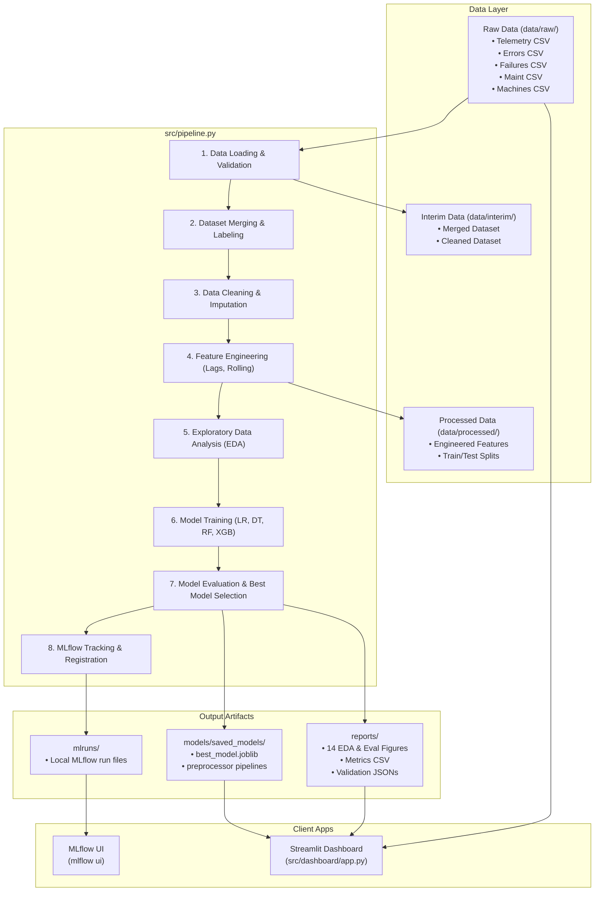

# 🏭 Smart Factory Predictive Maintenance (PdM)

[](https://www.python.org/)
[](https://mlflow.org/)
[](https://streamlit.io/)
[](./DEPLOYMENT.md)
[](./.github/workflows/ci-cd.yml)
[](https://opensource.org/licenses/MIT)


An enterprise-grade, end-to-end MLOps predictive maintenance system designed to predict component failures in industrial machinery before they happen. Powered by the **Microsoft Azure Predictive Maintenance Dataset** (100 machines, 1 year of hourly telemetry, errors, failures, and maintenance events).

---

## 📐 Architecture & Data Flow



---

## 📂 Project Structure

```
smart_factory_pdm/
├── configs/
│   └── config.yaml               ← Hyperparameters, paths, and model configurations
├── data/
│   ├── raw/                      ← Place the 5 Microsoft Azure PdM CSVs here
│   ├── interim/                  ← Merged and cleaned intermediate data
│   └── processed/                ← Feature-engineered datasets and train/test splits
├── logs/                         ← Rotating daily application log files
├── models/
│   └── saved_models/             ← Persistent trained model pipelines (.joblib)
├── notebooks/                    ← Jupyter EDA notebooks for interactive research
├── reports/
│   ├── figures/                  ← 10 EDA charts + 4 evaluation comparison charts (PNG)
│   └── metrics/                  ← model_comparison.csv + best_model_meta.json
├── src/
│   ├── __init__.py
│   ├── pipeline.py               ← Pipeline orchestrator wiring stages 1-8 together
│   ├── data/
│   │   ├── data_loader.py        ← Load raw data & validate column schemas
│   │   ├── data_merger.py        ← Join tables and build binary labels (24h lookahead)
│   │   └── data_cleaner.py       ← Deduplicate, forward-fill sensors, clip outliers, encode
│   │   └── data_validator.py     ← Strict schema, null, range, and variance validation
│   ├── features/
│   │   ├── feature_engineering.py ← Extract rolling window stats, lag profiles, interaction indices
│   │   └── eda.py                ← Auto-generate 10 production-quality diagnostic plots
│   ├── models/
│   │   └── model_trainer.py      ← Train LR, Decision Tree, Random Forest, & XGBoost models
│   ├── evaluation/
│   │   └── model_evaluator.py    ← Cross-model metric analysis, evaluation plot generator
│   ├── mlflow_tracking/
│   │   └── mlflow_tracker.py     ← Log metrics, parameters, and register models to MLflow
│   ├── dashboard/
│   │   ├── __init__.py
│   │   └── app.py                ← Streamlit Interactive Monitoring Dashboard
│   └── utils/
│       ├── logger.py             ← Configures stream & rotating file logger
│       ├── config_loader.py      ← Loads parameters from YAML config
│       ├── constants.py          ← Shared project constants and mappings
│       ├── metrics.py            ← Standardized metrics computation engine
│       └── exceptions.py         ← Custom project-specific exception definitions
├── requirements.txt              ← Core dependency manifest
├── run_pipeline.py               ← Pipeline entry-point execution script
└── README.md                     ← Documentation
```

---

## ⚡ Quick Start & Run Instructions

Follow these instructions to run the pipeline and run the dashboard locally on your Windows machine:

### 1. Set Up Environment & Install Dependencies
Open **PowerShell** or **Command Prompt** in the project directory:

```bash
# Activate your virtual environment
.\venv\Scripts\activate

# Install the updated dependency suite
pip install -r requirements.txt
```

### 2. Verify Raw Data Placement
Make sure the following 5 CSV files are in the `data/raw/` directory:
- `PdM_telemetry.csv`
- `PdM_errors.csv`
- `PdM_failures.csv`
- `PdM_maint.csv`
- `PdM_machines.csv`

### 3. Run the ML Pipeline
This executes the ingestion, cleaning, feature engineering, training, evaluation, and logging workflows:

```bash
python run_pipeline.py
```

### 4. Run the Streamlit Monitoring Dashboard
Launch the dashboard to monitor fleet health, view interactive sensor telemetry, inspect training metrics, and view dataset validation reports:

```bash
streamlit run src/dashboard/app.py
```

### 5. Launch the MLflow Experiment Tracking Dashboard
To inspect logged parameters, artifacts (confusion matrices, models), metrics history, and model registry:

```bash
mlflow ui
```
Open [http://localhost:5000](http://localhost:5000) in your browser.

---

## 📊 Pipeline Stage Capabilities

| Stage | Module | Key Operations |
|-------|--------|----------------|
| **1. Ingest** | `data_loader.py` | Validates file existence and checks basic structure. |
| **2. Validate** | `data_validator.py` | Schema constraints, missing values thresholds, range bounds, zero-variance columns. |
| **3. Merge** | `data_merger.py` | Joins telemetry with error codes, maintenance cycles, and machine profiles. Computes failure label indicators (24-hour lookahead). |
| **4. Clean** | `data_cleaner.py` | Handles deduplication, temporal forward-fills for sensors, clips outliers using IQR. |
| **5. Features** | `feature_engineering.py` | Generates 3h/24h rolling averages & std-dev, sensor lags (1h/3h/24h), time-based variables, and interaction ratios. |
| **6. Train** | `model_trainer.py` | Splits data chronologically to prevent temporal leakage. Trains Logistic Regression, Decision Trees, Random Forests, and XGBoost. |
| **7. Evaluate** | `model_evaluator.py` | Computes precision, recall, F1, and AUC. Generates diagnostic metrics charts (ROC, comparison bars, matrices). |
| **8. Track** | `mlflow_tracker.py` | Logs runs, models, parameters, performance metrics, and registers the champion model. |

---

## 🐳 Docker Deployment

The fastest way to run the complete platform in production is with Docker Compose.

### 3-Command Quickstart
```bash
# 1. Copy and configure environment
cp .env.example .env
# Edit .env: set FLASK_SECRET_KEY and ALLOWED_ORIGINS

# 2. Build and start all services
docker-compose -f docker-compose.yml up --build -d

# 3. Verify health
bash scripts/healthcheck.sh
```

### Service URLs (after startup)
| Service | URL |
|---|---|
| 🖥️ **Frontend Dashboard** | http://localhost |
| ⚡ **Backend API** | http://localhost:5000/health |
| 🧬 **MLflow UI** | http://localhost:5001 |

### Common Operations
```bash
# View logs from all services
docker-compose logs -f

# Stop all services
docker-compose down

# Create a backup
python scripts/backup.py

# Check component versions
python scripts/version_info.py
```

> 📖 For complete deployment documentation including cloud deployment (AWS ECS, Azure Container Apps, GCP Cloud Run), environment variable reference, backup/restore procedures, CI/CD pipeline, troubleshooting guide, and security hardening details — see **[DEPLOYMENT.md](./DEPLOYMENT.md)**.

---

## 🏷️ Versioning

The platform uses a single `VERSION` file as the source of truth.

```bash
# Check current version
cat VERSION

# View full version matrix (backend, frontend, model, MLflow registry)
python scripts/version_info.py

# Machine-readable JSON output
python scripts/version_info.py --json
```

| File | Purpose |
|---|---|
| `VERSION` | Single source of truth for platform version |
| `frontend/package.json` | Frontend npm package version |
| `configs/config.yaml` | ML pipeline configuration version |
| `reports/metrics/best_model_meta.json` | Active ML model metadata |
